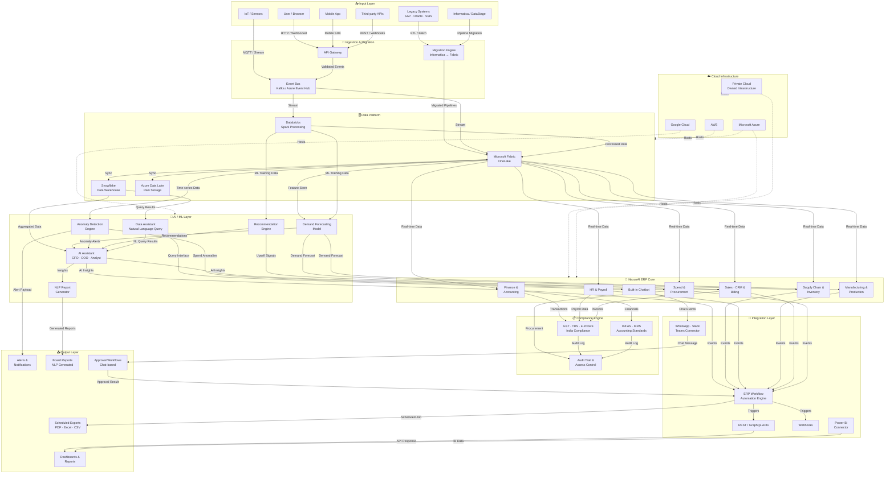

# NexusAI ERP — System Architecture (Nodes & Edges)

---

## Node Legend

| Layer | Nodes | Role |
|---|---|---|
| Input | I1–I6 | All data sources entering the system |
| Ingestion | M1–M3 | Migration engine, API gateway, event streaming |
| Data Platform | D1–D4 | OneLake, Snowflake, Databricks, ADLS |
| AI / ML | A1–A6 | AI Assistant, forecasting, anomaly, NLP, recommendations |
| ERP Core | E1–E7 | All 7 functional ERP modules |
| Compliance | C1–C3 | India GST/TDS, accounting standards, audit trail |
| Integration | N1–N5 | APIs, webhooks, chat connectors, Power BI, workflow engine |
| Output | O1–O5 | Dashboards, alerts, exports, board reports, approvals |
| Infrastructure | X1–X4 | AWS, Azure, GCP, private cloud |

## Key Edge Types

| Edge Style | Meaning |
|---|---|
| `-->` solid arrow | Active data flow |
| `<-->` bidirectional | Sync / two-way replication |
| `-.->` dashed | Infrastructure hosting relationship |
| Label on edge | Protocol or data type |
